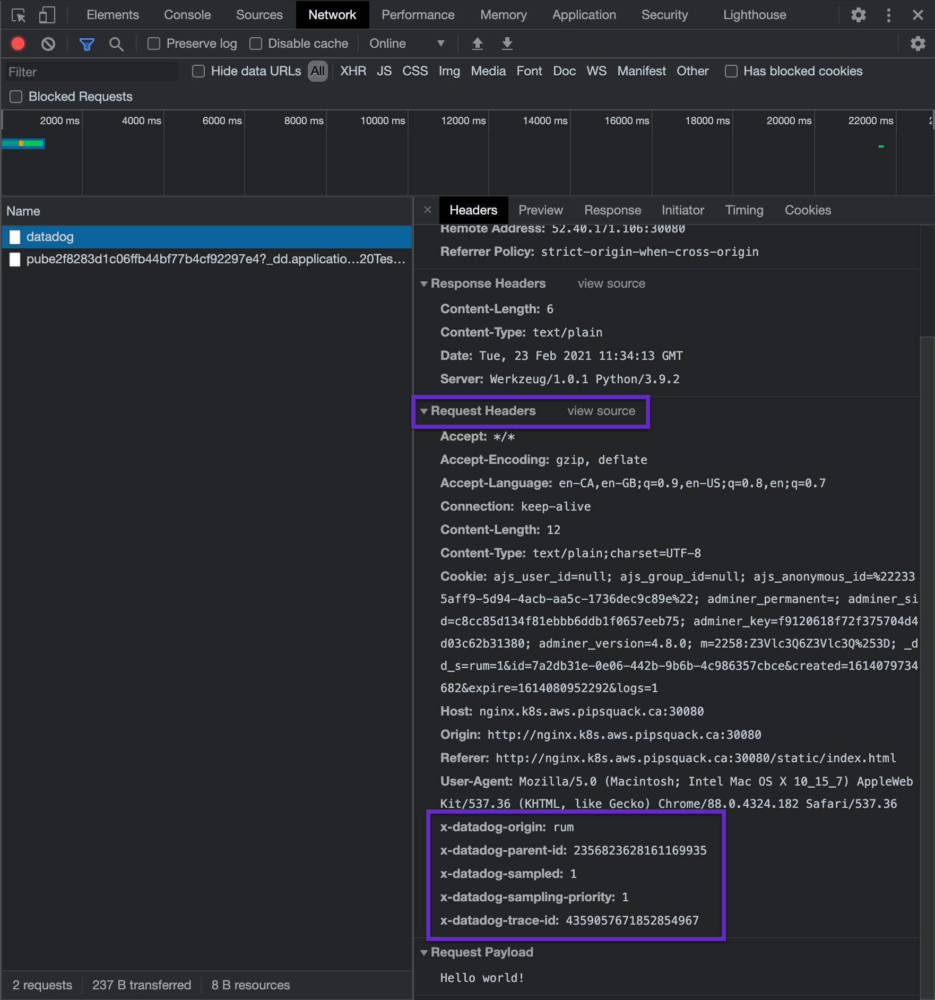
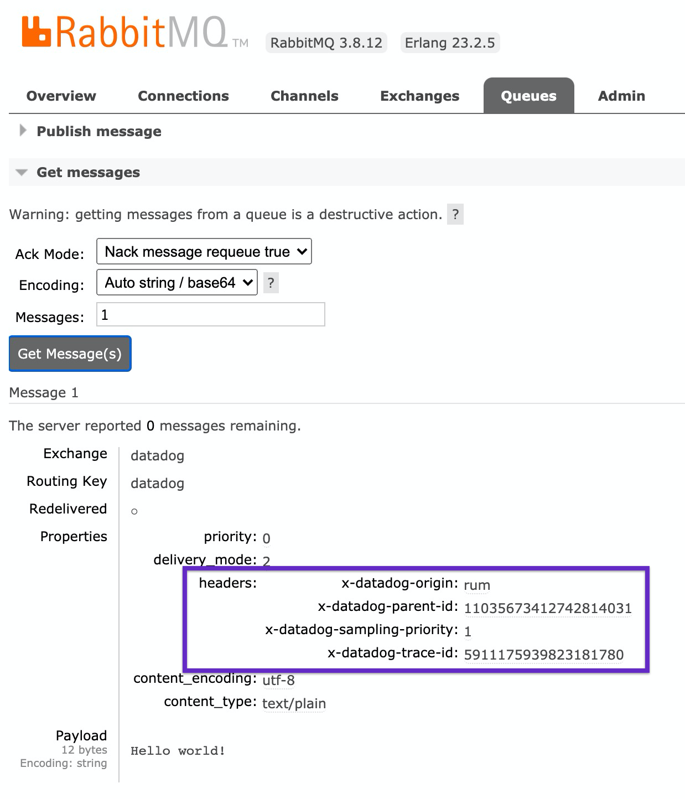

# Demo Python application

## Application links

- [Sample RUM app](http://ANY_K8S_NODE:30080/static/index.html) - Simple app for RUM testing
- [RabbitMQ](http://ANY_K8S_NODE:32080/) - guest/guest
- [Adminer](http://ANY_K8S_NODE:31080/) - SQL Client for MySQL

## Browser Synthetics

In order to get full end-to-end monitoring with Browser Synthetics, including traces, remember to propertly set [APM integration for Browser Tests](https://app.datadoghq.com/synthetics/settings/default).

## e2e Traces

RUM adds trace headers only to origins listed in [allowedTracingOrigins](https://docs.datadoghq.com/real_user_monitoring/connect_rum_and_traces/?tab=browserrum#rum-set-up). If you are not getting the headers, check if the origin is correct. It should include protocol, domain, and port.

Context is propagated in message brokers, like RabbitMQ and Kafka, by message headers.

